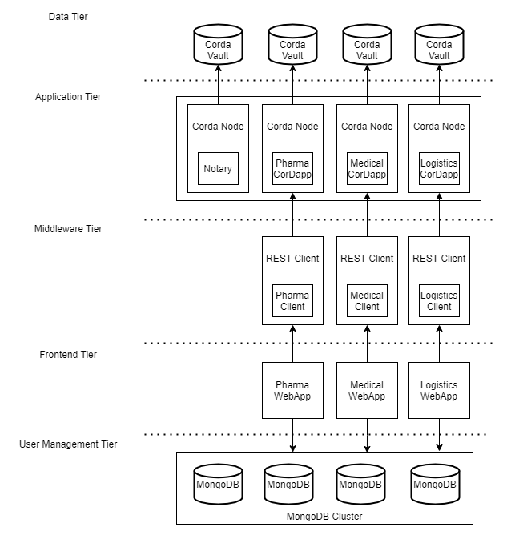

# PharmaLedger - Decentralised Clinical Trial

* * *
- [PharmaLedger - Decentralised Clinical Trial](#pharmaledger---decentralised-clinical-trial)
  - [Team Members](#team-members)
  - [Architecture](#architecture)
  - [Documentation](#documentation)
  - [Requirements](#requirements)
    - [Java](#java)
    - [Gradle](#gradle)
  - [Install CorDapp](#install-cordapp)
    - [Build the project from root directory](#build-the-project-from-root-directory)
    - [Deploy Nodes](#deploy-nodes)
    - [Launcing CorDapp](#launcing-cordapp)
  - [Install CorDapp using Docker](#install-cordapp-using-docker)
  - [Running Middleware](#running-middleware)
  - [Running Frontend](#running-frontend)
  - [Future Developments](#future-developments)
  - [Demo](#demo)
## Team Members
|Name | Degree | Mail Address|
|-----|--------|-------------|
|Anand Devarajan|Master in Informatics|anand.devarajan@tum.de|
|Christoph Hanus|Master in Management and Technology|christoph.hanus@tum.de|
|Lukas Volpers| Master in Management and Technology|lukas.volpers@tum.de|
|Thandayuthapani Subramanian|Master in Informatics|thandayuthapani.subramanian@tum.de|

## Architecture
<p align="center">
  
</p>

## Documentation
Project has been structured into main sub-directories - `./contracts`, `./workflows`, `./pharma-client`, `./medical-client`, `./logistics-client`.  
`./contracts` - Contains Corda states and Corda Contracts  
`./workflows` - Contains Corda flows used for creating transactions between different Corda nodes  
`./pharma-client` - Acts as middleware between Pharma UI portal and Corda Ledger  
`./medical-client` - Acts as middleware between Medical UI portal and Corda Ledger  
`./logistics-client` - Acts as middleware between Logistics UI portal and Corda Ledger  
## Requirements
* Java 8
* Gradle
* Docker and Docker Compose (Optional)

### Java
Install the Java 8 JDK. Corda requires at least version 8u171, but do not currently support Java 9 or higher for this version of Corda.
### Gradle
Corda requires a Gradle version between 5.1 and 5.6.4, and does not support Gradle 6.x.

## Install CorDapp
Once all the requirements are installed. CorDapp can be deployed by following steps:  

### Build the project from root directory
```
./gradlew clean build
```  

### Deploy Nodes
```
./gradlew deployNodes
```

Above command, creates node directory inside `./build` directory.  Each node in `./build/nodes` direcory is structed as follows:
In our project there are 4 nodes - `Notary`, `Pharma`, `Medical` `Logistics`
```
. nodeName
├── additional-node-infos
├── certificates
├── corda.jar              // The Corda node runtime
├── cordapps               // The node's CorDapps
│   ├── config
│   ├── corda-example-contracts-0.1.jar
│   └── corda-example-workflows-0.1.jar
├── djvm
├── drivers
├── logs
├── network-parameters
├── node.conf              // The node's configuration file
├── nodeInfo-<HASH>        // The hash will be different each time you generate a node
├── persistence.mv.db      // The node's database
└── persistence.trace.db   // The node's database
```

### Launcing CorDapp
To start the nodes, we can use `runnodes` script in `./build/nodes/runnodes`.
```
./build/nodes/runnodes
```

Or, nodes can be run seperately by running following command - 
```
java -jar corda.jar
```
from following node directories - `./build/nodes/Notary`, `./build/nodes/Pharma`, `./build/nodes/Medical`, `./build/nodes/Logistics`.

## Install CorDapp using Docker
Conversely, one can deploy CorDapp as containers using following command:
```
./gradlew deployNodesDocker
```
This command would create nodes directory inside `./build` directory.  We can launch CorDapps by running following command from project root directory:
```
docker-compose -f ./build/nodes/docker-compose.yml up
```

## Running Middleware 
Once CorDapp is deployed, launch REST client for Corda Nodes by running following commands from project root directory.
```
# Pharma Client
./gradlew runPartyPharmaServer

# Medical Client
./gradlew runPartyMedicalServer

# Logistics Client
./gradlew runPartyLogisticsServer
```

## Running Frontend
Frontend for this project is maintained in other repo - [PharmaLedger WebApp](https://gitlab.lrz.de/00000000014A5EBE/pharmaledger-webapp).  We have UI portal for different actors in PharmaLedger - Pharma, Medical, Logistics.
Steps to deploy different UIs are provided in following link:  
  

Pharma UI - [Pharma](https://gitlab.lrz.de/00000000014A5EBE/pharmaledger-webapp/-/tree/main/pharmaledger-pharma-ui)  
Medical UI - [Medical](https://gitlab.lrz.de/00000000014A5EBE/pharmaledger-webapp/-/tree/main/pharmaledger-medical-ui)  
Logistics UI - [Logistics](https://gitlab.lrz.de/00000000014A5EBE/pharmaledger-webapp/-/tree/main/pharmaledger-logistics-ui)  

## Future Developments
Future developments of this project will be done in following repository:  [PharmaLedger](https://github.com/thandayuthapani/pharmaledger)  
## Demo
Demo of this project can be found in following link: [Demo]()